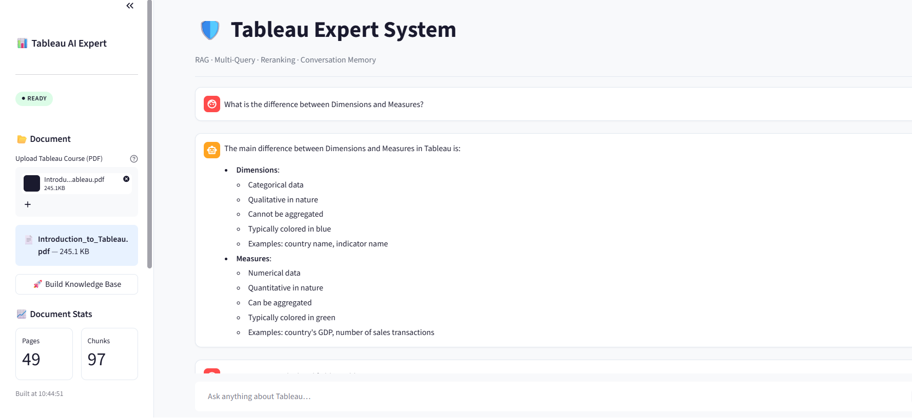
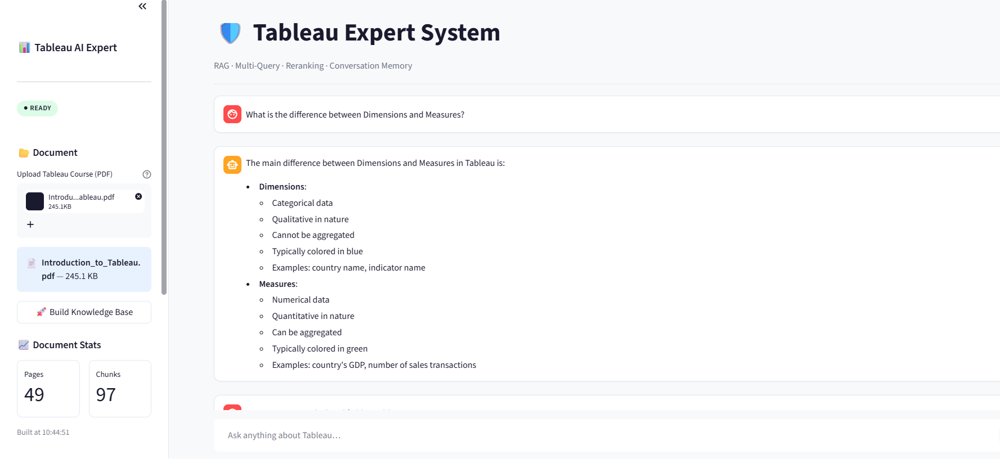
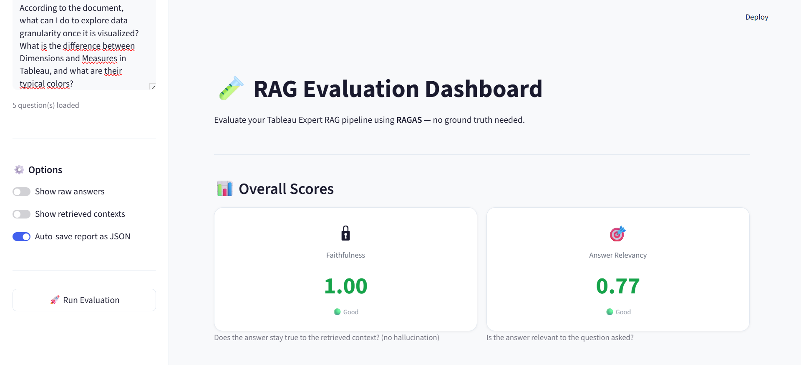

# 📊 Tableau AI Expert System

> 🚀 Intelligent RAG-based chatbot specialized in Tableau, capable of answering questions from PDF documents with **high accuracy, source grounding, and automatic evaluation using RAGAS**.

💡 This system combines **LLMs + Retrieval + Reranking + Evaluation** to deliver reliable, explainable answers for business intelligence learning.

---

## ✨ Key Features

* 🔎 Advanced Retrieval (MultiQuery + Reranking)
* 🧠 Context-aware conversation (chat memory)
* 📄 Source-grounded answers (no hallucination)
* 🧪 Automatic evaluation with RAGAS
* ⚡ Fast inference using Groq + Llama 3.3 70B

---

## 💼 Use Cases

* 📊 Learning Tableau concepts from PDF courses
* 🤖 AI assistant for business intelligence students
* 📄 Enterprise document Q&A system
* 🧠 Knowledge base exploration with explainable answers

---

## 🗂️ Project Structure

```
langchain-rag-tableau-assistant/
│
├── app.py                        # Main chatbot application
├── eval.py                       # RAGAS evaluation dashboard
│
├── langchain-rag-tableau-assistant.ipynb  # Prototyping notebook
│
├── .env                          # Environment variables (not versioned)
├── .streamlit/
│   └── config.toml               # Streamlit theme
│
└── README.md
```

---

## 🖼️ Application Preview

### 🤖 Main Chatbot Interface



Interactive AI assistant answering Tableau-related questions using RAG with conversation memory and source grounding.


### 📂 PDF Upload & Knowledge Base Creation



Upload Tableau course documents and automatically build a vectorized knowledge base for retrieval.


### 📄 Source Excerpts & Explainability


Each answer is backed by relevant document chunks with page references for transparency.


### 🧪 RAGAS Evaluation Dashboard



Evaluate the system using advanced metrics like Faithfulness, Answer Relevancy, and Context Precision.


### 📊 Score Distribution & Analysis


Visual comparison of evaluation metrics across multiple queries.

---

## ⚙️ Technical Architecture

The system is organized into **4 main phases**:

```
PDF
 │
 ▼
Phase 1 — Loading & Chunking
  PyPDFLoader → RecursiveCharacterTextSplitter (chunk=1000, overlap=200)
 │
 ▼
Phase 2 — Embedding & Storage
  HuggingFace Embeddings (all-MiniLM-L6-v2) → ChromaDB
  StreamlitChatMessageHistory (chat memory)
 │
 ▼
Phase 3 — Advanced Retrieval
  MultiQueryRetriever (query reformulation)
  → FlashrankRerank (top 5 relevant chunks)
 │
 ▼
Phase 4 — Generation
  History-Aware Retriever → RAG Chain → LLM (Llama 3.3 70B via Groq)
```

---

## 🎥 Demo

👉 Coming soon (video demo or live deployment)

---

## 🚀 Installation

### 1. Clone the repository

```bash
git clone https://github.com/votre-username/langchain-rag-tableau-assistant.git
cd langchain-rag-tableau-assistant
```

### 2. Create virtual environment

```bash
python -m venv venv

# Windows
venv\Scripts\activate

# macOS / Linux
source venv/bin/activate
```

### 3. Install dependencies

```bash
pip install streamlit langchain==1.2.14 langchain-classic langchain-community==0.4.1 \
            langchain-core langchain-groq langchain-huggingface langchain-chroma \
            langchain-text-splitters flashrank ragas datasets python-dotenv
```

### 4. Environment variables

Create a `.env` file:

```env
GROQ_API_KEY=your_groq_api_key_here
```

---

## ▶️ Run the Application

```bash
streamlit run app.py
```

---

## 🤖 Main Application (app.py)

### Features

* Upload PDF documents (Tableau courses)
* Automatic knowledge base creation
* Conversational chatbot with memory
* Source citation (page + excerpt)
* Suggested questions
* Debug mode
* Chat export (JSON)
* Performance statistics

---

## 🧪 Evaluation Dashboard (RAGAS)

### Features

* Editable test questions
* Automatic evaluation (no ground truth required)
* Visual score cards
* Detailed results table
* Charts & distributions
* Context inspection
* Export (CSV, JSON, Markdown)

### Metrics

| Metric               | Description               | Ideal Score |
| -------------------- | ------------------------- | ----------- |
| 🔒 Faithfulness      | No hallucination          | ≥ 0.75      |
| 🎯 Answer Relevancy  | Answers the question      | ≥ 0.75      |
| 📐 Context Precision | Relevant retrieved chunks | ≥ 0.75      |

---

## 📓 Notebook

The notebook contains:

* PDF loading and preprocessing
* Text chunking strategies
* Embedding experiments
* RAG pipeline prototyping

---

## 🛠️ Tech Stack

| Component  | Technology           |
| ---------- | -------------------- |
| UI         | Streamlit            |
| LLM        | Llama 3.3 70B (Groq) |
| Embeddings | all-MiniLM-L6-v2     |
| Vector DB  | ChromaDB             |
| Framework  | LangChain v1.2       |
| Reranking  | FlashRank            |
| Evaluation | RAGAS                |

---

## 🔮 Future Improvements

* Multi-document support
* Better UI/UX
* Deployment (Docker / Cloud)
* Advanced retrieval optimization
* Fine-tuned embeddings

---

## 👩‍💻 Author

**Hajar Boutayeb**
🎓 Master’s student in Data Science & Big Data  
💡 Passionate about AI, Data Science, and intelligent systems

📫 Open to internships and collaboration opportunities

---

## 📄 License

MIT
